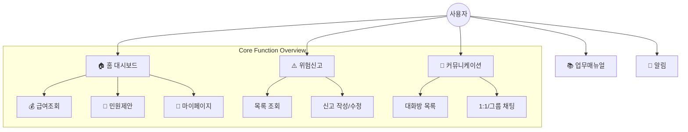

# LH EnS Flutter Application

## 📖 사용자 가이드 및 화면 구조 (User Guide & Screen Flow)

이 섹션은 비개발자 및 일반 사용자도 앱의 작동 원리를 쉽게 이해할 수 있도록 작성되었습니다.

### 1. 앱 메뉴 구조도 (Sitemap)
앱은 하단 5개의 탭을 통해 주요 기능에 접근할 수 있습니다.



### 2. 데이터 처리 흐름 알아보기 (Data Lifecycle)
*"내가 작성한 위험 신고가 어떻게 저장되고 관리자에게 보일까요?"*

사용자가 **'위험 신고'**를 작성하고 등록 버튼을 누르면, 다음과 같은 흐름으로 진행됩니다.

1.  **입력 (Input)**:
    -   사용자가 화면에서 장소, 위험 내용, 사진 등을 입력합니다.
    -   앱(Client)은 입력된 내용이 빠짐없이 잘 들어갔는지 1차로 검사합니다(유효성 체크).

2.  **전송 (Transport)**:
    -   검사가 끝난 데이터는 **JSON**이라는 가벼운 봉투에 담깁니다.
    -   앱은 이 봉투를 인터넷을 통해 **서버(LH EnS 서버)**로 발송합니다.
    -   이때, 아무도 훔쳐보지 못하게 안전한 통로(HTTPS/SSL)를 이용하며, 봉투에는 '작성자가 누구인지' 증명하는 **인증 토큰(Token)**이 함께 붙습니다.

3.  **저장 (Storage)**:
    -   서버는 봉투를 받아 열어보고, 문제가 없다면 **데이터베이스(DB)**라는 거대한 서랍장에 보관합니다.
    -   이제 이 데이터는 영구적으로 저장되어, 앱을 껐다 켜도 사라지지 않습니다.

4.  **표시 (Display)**:
    -   관리자가 PC 관리자 페이지를 켜거나, 다른 작업자가 앱 목록을 새로고침하면, 서버에서 데이터를 다시 꺼내 보여줍니다.
    -   이때 **실시간 알림(Socket/Push)**이 발동되어 담당자에게 "띠링! 새로운 위험신고가 접수되었습니다"라고 알려줍니다.

---
    
## 📚 프로젝트 문서 (Project Documentation)
상세한 기술 문서는 `docs/` 디렉토리에 관리됩니다.

*   [**00_INDEX.md**](docs/00_INDEX.md): 문서 목록 및 가이드
*   [**01_OVERVIEW.md**](docs/01_OVERVIEW.md): 프로젝트 개요 및 기술 스택
*   [**02_ARCHITECTURE.md**](docs/02_ARCHITECTURE.md): 시스템 아키텍처 (Flutter/NestJS)
*   [**03_API_SPEC.md**](docs/03_API_SPEC.md): API 명세 및 인증/에러 규약
*   [**04_DATA_MODEL.md**](docs/04_DATA_MODEL.md): 데이터 모델 및 관계
*   [**05_DEPLOYMENT_RUNBOOK.md**](docs/05_DEPLOYMENT_RUNBOOK.md): 배포 및 운영 가이드
*   [**06_TESTING_QA.md**](docs/06_TESTING_QA.md): 테스트 및 QA 체크리스트
*   [**07_SECURITY_CHECKLIST.md**](docs/07_SECURITY_CHECKLIST.md): 보안 점검 보고서
*   [**08_CHANGELOG_TEMPLATE.md**](docs/08_CHANGELOG_TEMPLATE.md): 릴리즈 노트 템플릿

---

# LH EnS Flutter Application 개발자 핸드북 (Developer Handbook)

## 개요 (Overview)
LH EnS 건설 현장 안전 관리 애플리케이션은 **대규모 건설 현장**의 복잡한 안전 관리 프로세스를 디지털화하고, 작업자와 관리자 간의 **실시간 커뮤니케이션**을 지원하는 엔터프라이즈 모바일 솔루션입니다. 본 문서는 프로젝트에 참여하는 개발자가 아키텍처, 디자인 패턴, 비즈니스 로직, 배포 프로세스 등을 심도 있게 이해하고 유지보수할 수 있도록 전문가 수준의 상세한 내용을 담고 있습니다.

프로젝트는 **유지보수성**, **확장성**, **테스트 용이성**을 최우선 가치로 두며, 이를 위해 엄격한 **Clean Architecture**와 **Feature-first** 구조를 채택했습니다.

---

## 🏗 아키텍처 및 디자인 원칙 (Architecture & Design Pattern)

### 1. Feature-first Layered Architecture
이 프로젝트는 기능(Feature) 단위로 패키지를 분리하는 **Feature-first** 아키텍처를 기반으로 합니다. 각 Feature 내부는 다시 역할별로 계층(Layer)이 나뉩니다. 이는 거대한 모놀리식 구조를 방지하고, 기능 간의 결합도를 낮추는 핵심 전략입니다.

#### 레이어 상세 설명
*   **View (Presentation Layer)**:
    *   사용자의 입력을 받고 화면을 그리는 역할만 수행합니다.
    *   비즈니스 로직을 포함하지 않으며, 오직 `Provider`를 구독(`watch`, `listen`)하여 상태 변화에 따라 UI를 갱신합니다.
    *   `ScreenUtil`을 사용하여 모든 디바이스에서 디자인 일관성을 유지합니다.
    *   **Anti-pattern**: `setState`를 남용하거나 API 호출 로직을 UI 코드 내부에 작성하는 것을 엄격히 금지합니다.
*   **Provider (State Management Layer)**:
    *   **ViewModel**의 역할을 수행합니다. `Riverpod`의 `StateNotifier` 또는 `Notifier`를 상속받아 구현됩니다.
    *   UI에서 발생한 이벤트를 받아 비즈니스 로직을 처리하고, `Repository`를 호출하여 데이터를 가져온 뒤 상태를 변경합니다.
    *   상태 객체는 불변(`immutable`)이어야 하며, 변경이 필요할 경우 `copyWith` 패턴을 사용합니다.
*   **Repository (Data Layer)**:
    *   외부 시스템(API 서버, DB 등)과의 데이터 통신을 담당합니다.
    *   `Retrofit` 클라이언트를 사용하여 API 엔드포인트를 추상화합니다.
    *   DTO(Data Transfer Object)를 도메인 모델로 변환하거나, 날것의 JSON 데이터를 핸들링합니다.
    *   API 에러 핸들링의 1차적인 방어선 역할을 합니다.
*   **Model (Domain Layer)**:
    *   데이터의 구조와 비즈니스 규칙을 정의하는 순수 Dart 클래스입니다.
    *   `Freezed`를 사용하여 `equality` 비교, `toString` 오버라이드, `json_serializable` 통합을 자동화합니다.

### 2. 상태 관리 패턴 (State Management with Riverpod)
본 프로젝트는 **Riverpod 2.x**를 전역 상태 관리 솔루션으로 사용합니다.

#### 주요 Provider 패턴
*   **`Provider`**:
    *   의존성 주입(DI) 용도로 사용됩니다. (예: `dioProvider`, `secureStorageProvider`)
    *   값이 캐시되며, 필요 시 `ref.watch`를 통해 다른 Provider에서 쉽게 접근할 수 있습니다.
*   **`StateNotifierProvider` (Legacy but active)**:
    *   복잡한 상태 관리를 위해 사용됩니다. 예를 들어, `PaginationProvider`는 `CursorPaginationBase`라는 상위 타입을 상태로 가지며, Loading, Error, Data, Refetching 등 다양한 상태를 관리합니다.
*   **`autodispose`**:
    *   화면을 벗어나면 상태를 초기화해야 하는 경우(예: 상세 조회 화면)에 적극적으로 사용합니다. `keepAlive` 옵션을 통해 캐싱 전략을 유연하게 가져갑니다.

### 3. 페이지네이션 전략 (Advanced Pagination Strategy)
리스트 형태의 데이터가 많은 엔터프라이즈 앱 특성상, 강력하고 재사용 가능한 페이지네이션 로직이 구현되어 있습니다.

*   `PaginationProvider<T, U>` 제네릭 클래스를 통해 모든 리스트 화면이 동일한 로직을 공유합니다.
*   **스로틀링(Throttling)**: `debounce_throttle` 패키지를 사용하여 짧은 시간 내 중복 요청을 방지합니다. 스크롤이 빠르게 이동할 때 불필요한 API 호출을 막아 서버 부하를 줄입니다.
*   **상태 머신(State Machine)**:
    *   `CursorPaginationLoading`: 최초 로딩
    *   `CursorPagination`: 데이터 로드 완료
    *   `CursorPaginationFetchingMore`: 리스트 바닥에 도달하여 추가 데이터 로딩 중 (사용자는 스피너 확인)
    *   `CursorPaginationRefetching`: Pull-to-refresh 동작 중 (기존 데이터 유지)
    *   `CursorPaginationError`: 네트워크 오류 등 예외 발생

---

## 🛠 기술 스택 상세 (Technology Stack Deep Dive)

### Core Framework
*   **Flutter SDK**: `>=3.9.0`
    *   최신 다트 문법(Records, Patterns 등)을 적극 활용합니다.
    *   Null Safety가 완벽하게 적용되어 런타임 Null Pointer Exception을 최소화합니다.

### Network & Communication
*   **Dio**: 강력한 HTTP 클라이언트
    *   **Interceptors**:
        *   `CustomInterceptor` (`lib/common/dio/dio.dart`): 모든 요청과 응답을 가로챕니다.
        *   **Token Refresh Logic**: 401 Unauthorized 응답 시, 뮤텍스(Lock)를 걸고 Refresh Token을 사용해 Access Token을 재발급받습니다. 재발급 성공 시 실패했던 요청을 큐에서 꺼내 재전송합니다. 이 과정은 사용자에게 보이지 않습니다(Transparent).
*   **Retrofit**: Type-safe REST Client
    *   Annotation(`@GET`, `@POST`, `@Body`)을 사용하여 API 명세를 인터페이스로 정의하면, 구현 코드가 자동 생성됩니다.
*   **Socket.IO Client**: 실시간 통신
    *   채팅 시스템 및 서버 푸시 메시지 수신을 위해 사용됩니다.
    *   연결 끊김 시 자동 재접속 로직 및 Heartbeat 체크가 구현되어 있습니다.

### Local Persistence
*   **Flutter Secure Storage**: 보안 저장소
    *   Access Token, Refresh Token 등 민감한 인증 정보를 OS의 Keystore/Keychain에 암호화하여 저장합니다.
*   **Shared Preferences**: 경량 저장소
    *   '자동 로그인 여부', '마지막으로 본 공지사항 ID' 등 보안이 중요하지 않은 사용자 설정값을 저장합니다.

### UI Experience
*   **Flutter ScreenUtil**: 반응형 레이아웃
    *   디자인 시안(Figma)의 기준 해상도(`390x844`)를 기반으로, 모든 디바이스에서 비율이 유지되도록 스케일링합니다. `14.sp`, `20.w` 등 단위를 사용하여 직관적인 UI 개발이 가능합니다.
*   **Flutter SVG**: 벡터 아이콘
    *   해상도에 상관없이 깨지지 않는 선명한 아이콘을 제공합니다.
*   **GoRouter**: 내비게이션
    *   URL 기반의 라우팅 시스템입니다. 딥링크(Deep Link) 처리에 최적화되어 있으며, 웹으로 빌드 시 URL 히스토리 관리가 자동으로 지원됩니다.

---

## 📂 프로젝트 상세 구조 (Project Structure Details)

```text
lib/
├── common/                  # [Shared] 전역 공통 모듈
│   ├── components/          # Design System 컴포넌트 (버튼, 인풋, 카드, 모달 등)
│   ├── const/               # 전역 상수 (API URL, Color Palette, Route Path)
│   ├── dio/                 # Network 설정 (Dio Instance, Logging, Interceptor)
│   ├── layout/              # 스캐폴딩 레이아웃 (DefaultLayout: AppBar, SafeArea 처리)
│   ├── model/               # 공통 응답 모델 (CursorPagination, ErrorResponse)
│   ├── provider/            # 전역 상태 (GoRouter, Pagination 로직)
│   ├── secure_storage/      # 로컬 스토리지 래퍼
│   ├── theme/               # ThemeData 설정 (TextStyles, Colors)
│   └── utils/               # 헬퍼 함수 (DataUtils, Validator)
│
├── user/                    # [Domain] 사용자 도메인
│   ├── auth/provider        # 인증 상태 관리 (AuthProvider: 리다이렉트 로직 포함)
│   ├── view/                # 로그인, 회원가입, 내 정보 화면
│   ├── repository/          # Auth 관련 API (login, token refresh)
│   └── model/               # User 모델 (UserModel, UserModelBase)
│
├── risk/                    # [Domain] 위험 신고
│   ├── view/                # 위험 신고 목록, 상세, 등록 화면
│   ├── provider/            # 위험 신고 CRUD 상태 관리
│   ├── repository/          # 위험 신고 API
│   └── model/               # Risk 모델
│
├── chat/                    # [Domain] 채팅
├── alarm/                   # [Domain] 알림
├── home/                    # [Domain] 메인 대시보드
├── gen/                     # [Generated] CodeGen 결과물 (Assets 등)
├── firebase_options.dart    # [Config] 파이어베이스 설정
└── main.dart                # [Entry] 앱 진입점
```

---

## � API 상세 목록 (Reference)

본 프로젝트는 RESTful API 표준을 일부 차용하여 리소스 기반의 URI 설계를 따르고 있습니다.
인증 헤더(`accessToken`)가 필요한 요청은 API Client(Dio) 레벨에서 자동으로 주입됩니다.

### 1. 사용자 및 인증 (Auth & User) / `user`, `auth`
| 메서드 | 엔드포인트 | 설명 | 헤더 요구 |
| :--- | :--- | :--- | :---: |
| `POST` | `/auth/login` | 사용자 로그인 (Access/Refresh Token 발급) | X |
| `POST` | `/auth/token` | Access Token 재발급 | Refresh |
| `GET` | `/user/me` | 내 정보 조회 | Access |
| `PATCH` | `/user/password` | 비밀번호 변경 | Access |

---

### 2. 위험 신고 (Risk) / `board-risk`
| 메서드 | 엔드포인트 | 설명 | 헤더 요구 |
| :--- | :--- | :--- | :---: |
| `GET` | `/board-risk` | 위험 신고 목록 조회 (페이지네이션 지원) | Access |
| `GET` | `/board-risk/{id}` | 위험 신고 상세 조회 | Access |
| `POST` | `/board-risk` | 새로운 위험 신고 게시물 등록 | Access |
| `PATCH` | `/board-risk` | 위험성 평가 수정 (Query: wrId) | Access |
| `DELETE` | `/board-risk` | 위험성 평가 삭제 (Query: wrId) | Access |
| `POST` | `/board-risk/comment` | 댓글 등록 (Query: parentId) | Access |

---

### 3. 공지사항 (Notice) / `board-notice`
| 메서드 | 엔드포인트 | 설명 | 헤더 요구 |
| :--- | :--- | :--- | :---: |
| `GET` | `/board-notice` | 공지사항 목록 조회 (페이지네이션 지원) | Access |
| `GET` | `/board-notice/{id}` | 공지사항 상세 조회 | Access |
| `POST` | `/board-notice` | 공지사항 등록 | Access |
| `PATCH` | `/board-notice` | 공지사항 수정 | Access |
| `DELETE` | `/board-notice` | 공지사항 삭제 | Access |

---

### 4. 채팅 (Chat) / `room`
| 메서드 | 엔드포인트 | 설명 | 헤더 요구 |
| :--- | :--- | :--- | :---: |
| `GET` | `/room` | 채팅방 목록 조회 (페이지네이션 지원) | Access |
| `POST` | `/room` | 채팅방 생성 (그룹/1:1) | Access |
| `GET` | `/room/{id}` | 채팅방 상세 정보 조회 | Access |
| `PATCH` | `/room/{id}` | 채팅방 정보 수정 | Access |
| `DELETE` | `/room/{id}` | 채팅방 나가기(Exit) | Access |

---

### 5. 알림 (Notification) / `notification`
| 메서드 | 엔드포인트 | 설명 | 헤더 요구 |
| :--- | :--- | :--- | :---: |
| `GET` | `/notification` | 알림 목록 조회 (Query: isRead) | Access |
| `PATCH` | `/notification/{id}` | 알림 읽음 처리 | Access |

---

## �💡 주요 비즈니스 로직 심층 분석 (Deep Dive Logic)

### 1. 인증 시스템 (Authentication System)
가장 복잡하고 중요한 로직 중 하나입니다. `lib/user/auth/provider/auth_provider.dart`에 집중되어 있습니다.

*   **앱 실행 시퀀스**:
    1.  `SplahScreen` 진입.
    2.  `SecureStorage`에서 `ACCESS_TOKEN`, `REFRESH_TOKEN` 확인.
    3.  유효성 검증 API 호출.
        *   성공: `GoRouter`가 `/home`으로 리다이렉트.
        *   실패: `SecureStorage` 비우고 `/login`으로 리다이렉트.
*   **리다이렉트 가드 (Redirect Guard)**:
    *   `GoRouter`의 `redirect` 콜백을 사용하여 라우팅 레벨에서 보안을 강제합니다.
    *   `UserModel` 상태가 `null`이거나 `Error` 상태인 경우, 어떤 페이지로 접근하더라도 강제로 로그인 페이지로 보냅니다 (Whitelist 방식: 로그인/비번찾기 페이지 제외).
    *   로그인 상태에서 로그인 페이지 접근 시 홈으로 튕겨냅니다.

### 2. 동적 폼 생성 (Dynamic Form Generation)
`RiskFormScreen`과 `ReportFormScaffoldV2`는 매우 유연한 폼 시스템을 제공합니다.
*   서버에서 내려주는 설정(Config) 데이터에 따라 입력 필드가 동적으로 구성됩니다.
*   위험성 평가 등록 시, 사용자의 카테고리 선택에 따라 하위 입력 옵션이 실시간으로 변경됩니다. 이 로직은 `setState`가 아닌 `Riverpod`을 통해 상태를 전파하여 렌더링 최적화를 달성합니다.

### 3. API 에러 핸들링 계층 (Error Handling Hierarchy)
 1. **Repository Layer**: `DioException` 발생 시 그대로 throw.
 2. **Provider Layer**: `try-catch`로 감싸서 UI가 이해할 수 있는 상태(`CursorPaginationError`)로 변환.
 3. **UI Layer**: 상태가 `Error`인 경우, `Toast` 메시지를 띄우거나 에러 페이지를 보여주고 '재시도' 버튼을 제공.

---

## 🧪 코드 생성 가이드 (Code Generation Guide)

이 프로젝트는 **Boilerplate Code**를 줄이고 **Type Safety**를 보장하기 위해 Code Generation을 적극 활용합니다.

### 사용되는 생성기(Generators)
*   **build_runner**: 다트 빌드 시스템의 핵심입니다.
*   **freezed**:
    *   `copyWith`, `toString`, `operator ==`, `hashCode` 자동 구현.
    *   Sealed Class 패턴(Union Type) 지원으로 상태 관리 분기 처리를 안전하게 만듭니다.
*   **json_serializable**: `fromJson`, `toJson` 메서드 자동 생성.
*   **retrofit_generator**: Retrofit 인터페이스 구현체 생성.
*   **riverpod_generator**: Provider 선언 문법 간소화 및 `Transitive Dependency` 자동 추적.

### 실행 명령어
```bash
# 단순 1회 빌드 (충돌 시 자동 삭제 옵션 포함)
dart run build_runner build --delete-conflicting-outputs

# 개발 모드 (파일 변경 감지하여 자동 빌드)
# 터미널 하나를 쪼개서 항상 켜두는 것을 권장합니다.
dart run build_runner watch --delete-conflicting-outputs
```

---

## 📝 개발 컨벤션 (Development Convention)

### 1. 코드 스타일
*   `analysis_options.yaml`에 정의된 `flutter_lints`를 엄격히 준수합니다.
*   코드 저장 시 `dart format`이 자동 실행되도록 IDE를 설정하세요.
*   모든 위젯 트리의 마지막 콤마(`,`)를 유지하여 가독성을 높입니다.

### 2. 파일 명명 규칙
*   **Lower Snake Case**를 사용합니다. (예: `user_repository.dart`)
*   클래스명은 **Upper Camel Case**를 사용합니다. (예: `UserRepository`)

### 3. 커밋 메시지 (Commit Message)
참고: [Conventional Commits](https://www.conventionalcommits.org/)
*   `feat: 사용자 로그인 기능 구현`
*   `fix: 토큰 재발급 무한 루프 버그 수정`
*   `docs: README 문서 업데이트`
*   `style: 포맷팅 수정 (코드 변경 없음)`
*   `refactor: 프로바이더 구조 개선`
*   `test: 로그인 유닛 테스트 추가`
*   `chore: 빌드 도구 설정 변경`

---

## 🚀 배포 및 CI/CD (Deployment)

### Android
*   `android/app/build.gradle`에서 `versionName`, `versionCode`를 관리합니다.
*   **Keystore 관리**: `key.properties` 파일은 git에 포함되지 않으므로, 별도로 보안 관리자에게 공유받아야 합니다.
*   빌드 명령어:
    ```bash
    flutter build apk --release --no-shrink
    flutter build appbundle --release
    ```

### iOS
*   `Podfile`이 `ios/` 폴더 내에 존재합니다. 네이티브 의존성 변경 시 반드시 `pod install`을 수행해야 합니다.
*   **Signing**: Xcode에서 Provisioning Profile 설정이 필요합니다.
*   빌드 명령어:
    ```bash
    flutter build ipa --release
    ```

---

## ⚠️ 트러블슈팅 및 FAQ (Troubleshooting)

**Q. `part '...g.dart';` 구문에서 빨간 줄이 뜹니다.**
> A. 코드 생성기가 실행되지 않았습니다. `dart run build_runner build -d`를 실행하세요.

**Q. Android 에뮬레이터에서 로컬 서버(localhost)에 접속이 안 됩니다.**
> A. Android 에뮬레이터는 `localhost`를 `10.0.2.2`로 인식합니다. `lib/common/const/data.dart`에서 `emulatorIp` 설정을 확인하세요.

**Q. iOS 시뮬레이터에서 키보드가 안 올라옵니다.**
> A. 시뮬레이터 메뉴에서 `I/O -> Keyboard -> Connect Hardware Keyboard` 체크를 해제하거나 `Cmd + K`를 눌러 토글하세요.

**Q. 앱을 릴리즈 모드로 빌드했더니 특정 API가 동작하지 않습니다.**
> A. 난독화(Obfuscation) 문제일 수 있습니다. `JsonSerializable`을 사용하는 모델 클래스들이 난독화되지 않도록 `@JsonSerializable(explicitToJson: true)` 옵션을 확인하거나 Proguard 규칙을 점검하세요. (현재 프로젝트는 모델 생성 코드가 이를 처리합니다.)

**Q. 소켓 연결이 자꾸 끊어집니다.**
> A. 앱이 백그라운드로 진입하면 OS 정책상 소켓 연결이 끊길 수 있습니다. `WidgetsBindingObserver`의 `didChangeAppLifecycleState`를 통해 앱이 포그라운드로 돌아올 때 `socket.connect()`를 재호출하는 로직이 있는지 확인하세요.

---

## 📞 지원 및 연락처 (Support)
이 프로젝트의 기술적 문의사항이나 버그 제보는 이슈 트래커(JIRA/Github Issues)를 이용해 주세요.
보안 관련 긴급 이슈는 보안 담당자에게 즉시 연락 바랍니다.
