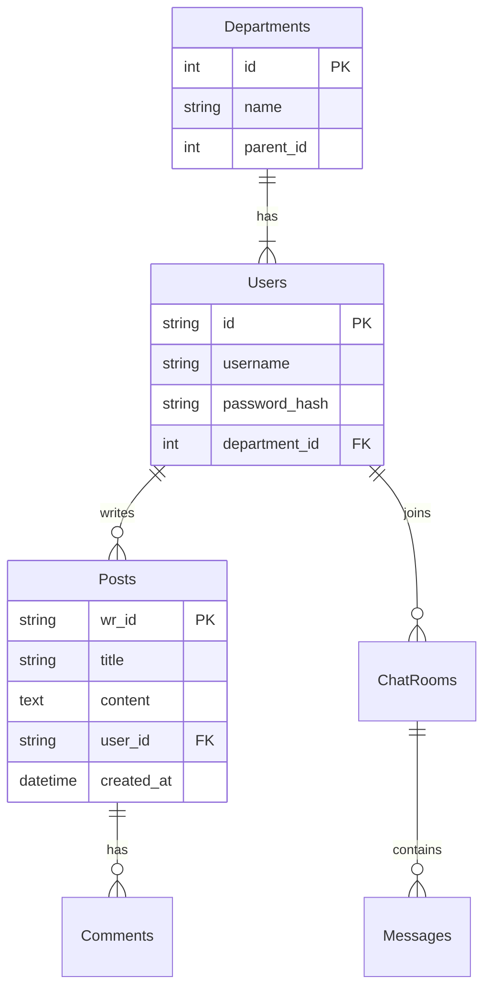

# 04. 데이터 모델 (Data Model)

## 1. 개요
본 문서는 Flutter 클라이언트의 DTO 및 Model 클래스를 기반으로 데이터 구조를 설명합니다.
서버 DB 스키마(Entity)는 접근이 불가능하여 클라이언트 모델로 대체합니다.

## 2. 주요 모델 (Flutter Models)

### 2.1 회원 (UserModel)
*   **식별자**: `id` (String/Int 추정)
*   **주요 필드**:
    *   `username`: 로그인 아이디
    *   `nickname`: 사용자 이름
    *   `email`: 이메일 (Optional)
    *   `imageUrl`: 프로필 이미지 URL
    *   `department`: 소속 부서 (`DepartmentModel`)

### 2.2 게시글 (PostModel / Risk)
*   **식별자**: `wrId` (String) - 원글 ID
*   **주요 필드**:
    *   `title`: 제목
    *   `content`: 내용 (`PostDetailModel`에만 포함될 수 있음)
    *   `author`: 작성자 (`UserModel`)
    *   `createdAt`: 작성일시
    *   `replyCount`: 댓글 수

### 2.3 채팅방 (ChatRoom)
*   **식별자**: `id` (String)
*   **주요 필드**:
    *   `title`: 방 제목
    *   `users`: 참여자 목록 (`List<UserModel>`)
    *   `lastMessage`: 마지막 메시지 내용
    *   `lastMessageAt`: 마지막 메시지 시간

### 2.4 부서 (DepartmentModel)
*   **식별자**: `id` (Int)
*   **주요 필드**:
    *   `name`: 부서명
    *   `parentId`: 상위 부서 ID (계층 구조)

### 2.5 급여 (SalaryModel)
*   **식별자**: `paymentDate` (String YYYY-MM) 등
*   **주요 필드**:
    *   `totalAmount`: 실 수령액
    *   `items`: 급여 상세 항목 리스트
    *   `htmlContent`: 명세서 HTML 원본 (상세 조회 시)

## 3. 공통 응답 래퍼 (Pagination)
### 3.1 PagePagination<T>
일반 게시판 페이징 처리에 사용됩니다.
*   `data`: `List<T>` (실제 데이터 목록)
*   `meta`: 페이지 메타 데이터 (`totalCount`, `count` 등)

### 3.2 CursorPagination<T>
채팅/무한스크롤 등에 사용됩니다.
*   `data`: `List<T>`
*   `meta`: `CursorPaginationMeta` (`count`, `hasMore`) -> `hasMore`가 `true`면 다음 데이터 요청 가능.

## 4. 데이터베이스 ERD (추정)
*서버 코드가 없어 정확한 관계는 불명확하나, DTO 구조상 아래 관계가 유추됨.*

